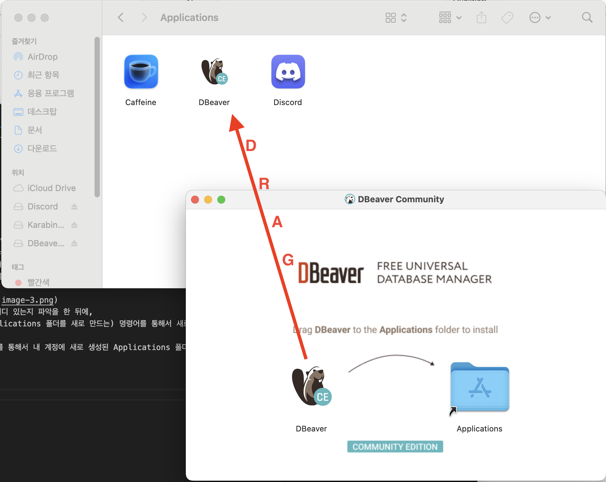
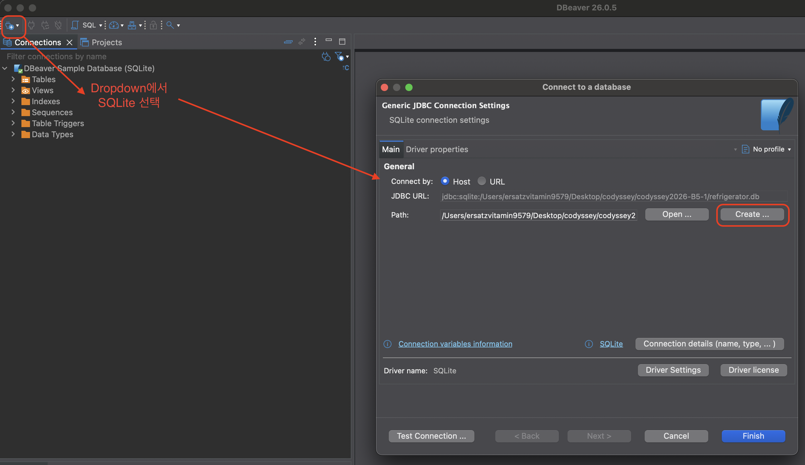
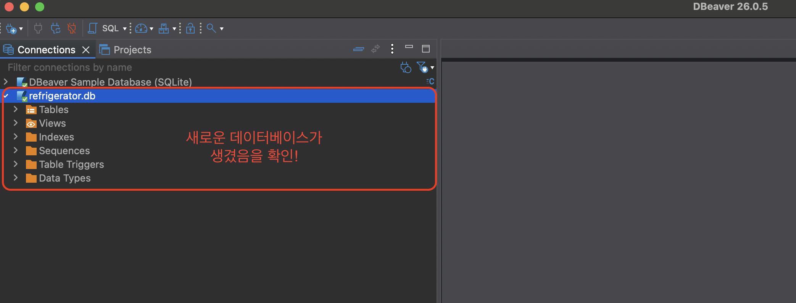
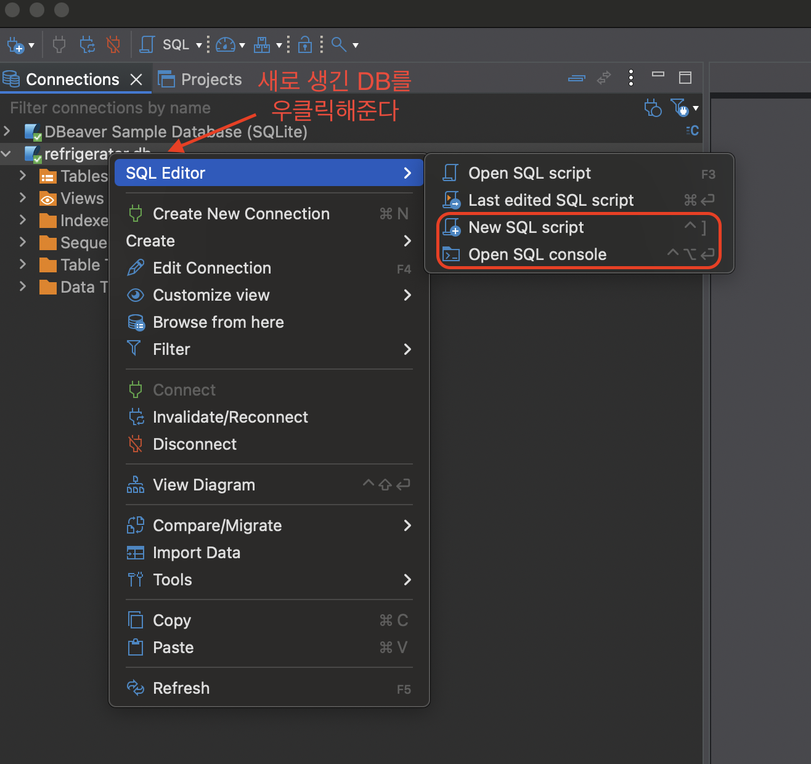
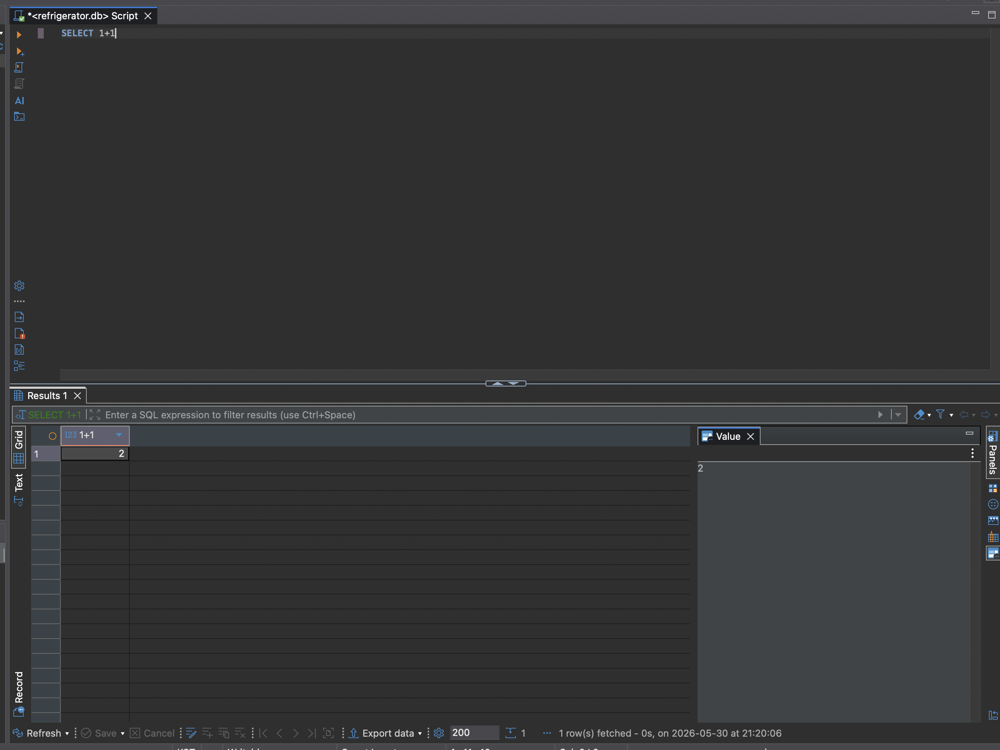

우선 DBeaver 홈페이지로 들어가 보자. (https://dbeaver.io)

DBeaver Community 버전은 무료이자 오픈소스인 데이터베이스 관리 툴이라고 하며, MySQL, MariaDB, PostgreSQL, SQLite, Apache Family 등 다양한 데이터베이스를 다룰 수 있다고 한다.

그리고 바로 아랫부분에 DBeaver Pro 버전 광고를 하고 있음을 확인할 수 있다. (그것도 Table로!)

홈페이지로 들어가서 다운로드 탭을 누르면 (https://dbeaver.io/download/)

다음과 같은 화면이 나온다. 화면 우측을 보면 기쁘게도 교육장 컴퓨터의 사양을 자동으로 파악하고
MacOS Intel 버전 DMG 파일을 바로 받을 수 있게 해 준다.

DBeaver.dmg를 다운로드하고 더블클릭하면 다음과 같이 나온다.

개인 컴퓨터라면 오른쪽의 Applications 바로가기에 파일을 드래그해 넣으면 되겠지지만, 교육장의 컴퓨터는 그런 것을 모두 관리자 권한으로 막고 있다. 로컬 설치를 위해서는 우회로가 필요한 것이다.
그 우회로란 사용자 폴더 안에 Applications 폴더를 새로 만들고(관리자 권한을 사용하지 않는), .dmg 등 드래그해서 설치할 수 있는 파일을 그 Applications 폴더에 끌어넣는 것이다.

우선 Terminal을 켠다. ls, pwd 등을 통해서 내가 어디 있는지 파악을 한 뒤에, 
`mkdir ~./Applicataions` (루트 디렉토리에 Applications 폴더를 새로 만드는) 명령어를 통해서 새로 폴더를 만들어 준다.
그 뒤에 `cd Applications` -> `open .` 명령어를 통해서 내 계정에 새로 생성된 Applications 폴더를 열어준 뒤에 드래그-앤-드랍을 해준다.

인스톨 후 실행을 해 주며면 다음과 같은 화면이 나온다.

첫 실행이니만큼 바로 샘플 데이터베이스를 둘러보겠냐는 질문이 나온다. YES를 누르면 바로..  

SQLite 드라이버 파일을 설치해야 파일들을 볼 수 있다고 나온다. 바로 Download를 눌러서 인스톨을 해 준다.

이제는 새로운 .db 파일을 만들어야 한다. 왼쪽 위의 전원 플러그 아이콘을 클릭해 보면, 드랍다운 메뉴가 나온다.

path에서 Create를 누르고, 작업물이 저장된 폴더에 원하는 이름의 db를 만들어 보자.
본 작업자는 셰어하우스에서 공동으로 사용하는 냉장고의 데이터베이스를 상정했기 때문에 `refrigerator.db` 라는 이름으로 만들었다.

이제, 만들어진 db가 왼쪽에 보이는데, 여기를 오른쪽 클릭해서 SQL 에디터를 열어줘야 한다.

열린 테스트 이미지에 기본 테스트를 해보자.
`SELECT 1 + 1` 을 입력하고, 위의 재생 버튼 혹은 Cmd + Enter를 입력하면

다음과 같이 결과가 나온다.

이제 schema를 디자인하고 테이블을 생성하는하는 다음 단계로 넘어가 보자.

[Table만들기_및_샘플데이터_넣기](02.Schema_Creation_and_sample_data_insertion.md)