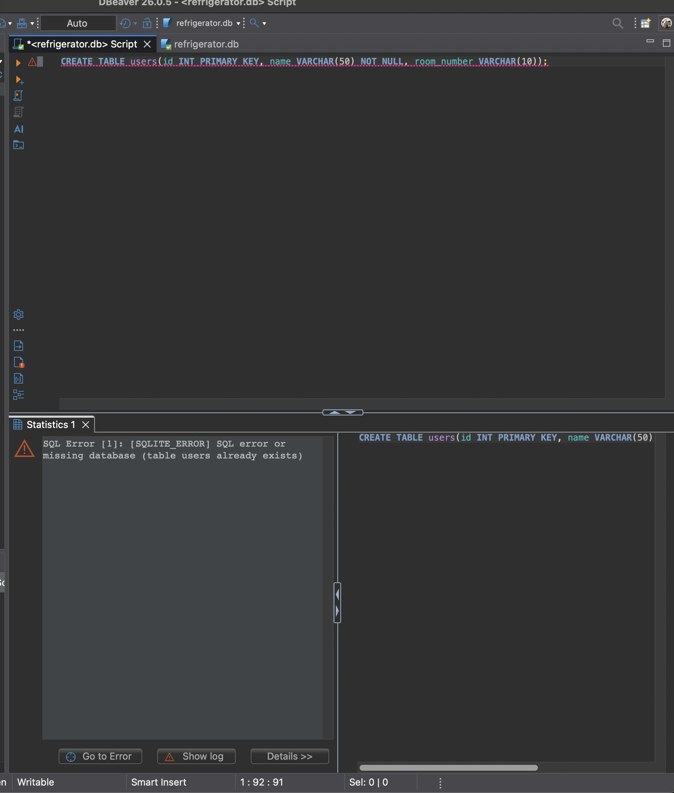
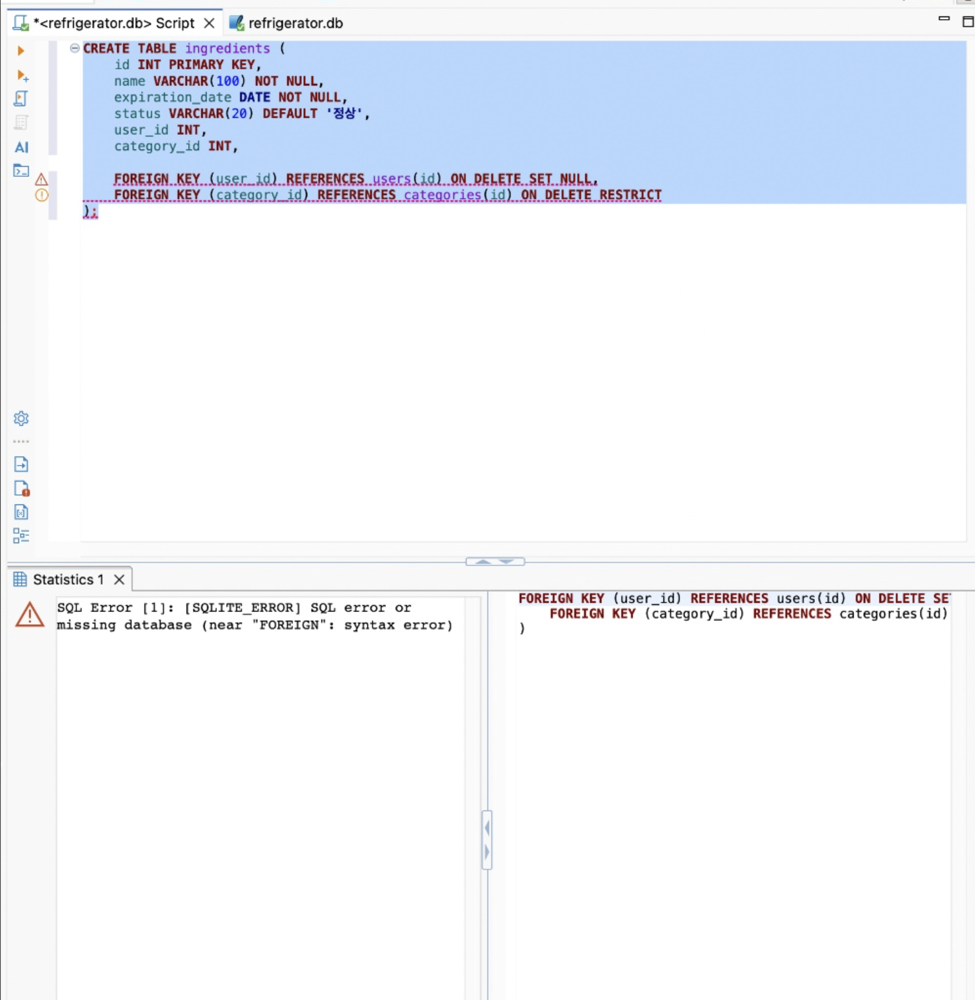
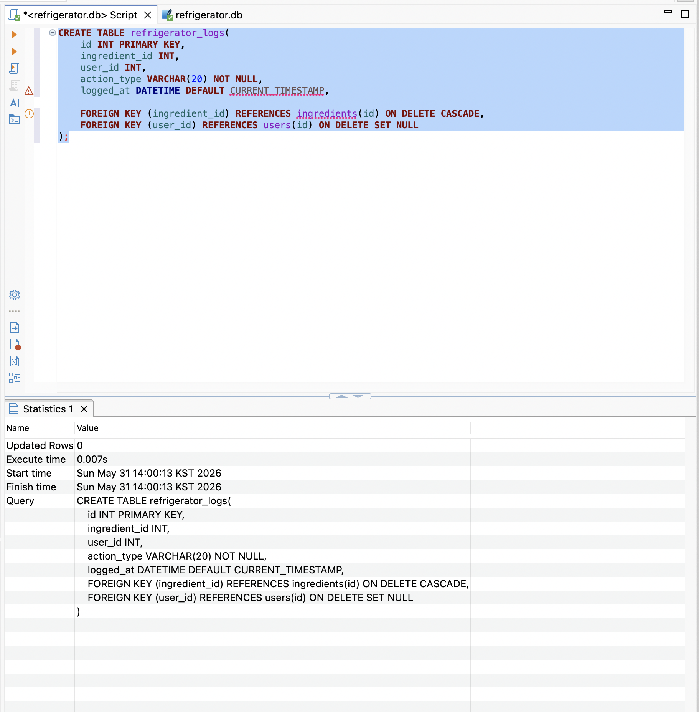

[테이블 생성 명령어 네 개](1.schema_creation.sql) 을 직접 하나씩 입력해 보았다.

SQL 명령어를 완성한 뒤에는 Cmd + 엔터 키로 바로 실행할 수도 있고, 윗부분의 ▶️ 재생 버튼을 눌러서 실행할 수도 있다.
Cmd+엔터를 누른 뒤에 다시 ▶️ 을 누르게 되면 위에 나온 스크린샷부터 에러가 나게 된다. 

#### 트러블슈팅!
다만 이전 schema를 잘못 짜서 테이블을 잘못 만들었어요! 지우고 다시 만들고 싶어요! 하는 경우에는?
`DROP TABLE [테이블_이름];` 명령어를 써서 해당 테이블을 지우면 된다. 또한, .sql로 여러 개의 테이블을 자동으로 생성하는는 스크립트를 쓰는 경우에는, 스크립트 초반에 데이터베이스를 만드는 명령어 바로 뒤에 `DROP TABLE IF EXISTS [이제_만들_테이블_이름];` 와 같이 앞에 있을 장애물을 치우고 본 테이블 작성 스크립트를 순차적으로 실행하게 된다.

동료 교육생 OliverJoo님의 스크립트 일부를 발췌해 보겠다. 이 분은 도커 컴포즈와 shell script로 고도의 자동화를 해놓으셔서 여러 부분에서 참고해볼만 하다.
[링크](https://github.com/OliverJoo/codyssey_ai/blob/main/AI_SW/01_Basic/b5-1/cafe-order-mariadb/01_schema.sql)

```SQL
CREATE DATABASE IF NOT EXISTS cafe_order_db
  CHARACTER SET utf8mb4
  COLLATE utf8mb4_unicode_ci;

USE cafe_order_db;

SET NAMES utf8mb4;

DROP TABLE IF EXISTS order_items; -- 이 부분을 주목하자
DROP TABLE IF EXISTS orders; -- 이 부분도 주목하자
DROP TABLE IF EXISTS menu_items; -- 이 부분도 주목하자(2)
DROP TABLE IF EXISTS categories; -- 이 부분도 주목하자(3)
DROP TABLE IF EXISTS customers; -- 이 부분도 주목하자(4)
```
`DROP TABLE`바로 뒤의, 이 코딩테스트 연습문제 삼항조건식을 연상시키는 이 부분 `IF EXISTS [테이블_이름]` 이 중복을 방지해주는 것이다.


그렇게 하나씩 입력하던 와중 생긴 에러.


제미나이에게 물어보니 SQLite의 한계인가 뭔가 해서 다시 자간도 조정하고 오타도 체크해본 결과, 원인은 알 수가 없었는데,
명령어의 전부를 드래그한 뒤에 실행을 해 보니....



이제는 된다! 나중에 이야기를 들어보니, SQL 스크립트를 실행할 때는 드래그를 한 부분만 따로 실행이 된다고 한다. 끔찍해라!

