## [보너스 실습_1. Join 1개를 두가지 방식으로 풀기]
### 냉장고에 유제품(category_id=1)을 넣어둔 사용자의 이름과 방 번호 구하기

-- ㄱ. JOIN을 이용한 풀기
```SQL
SELECT DISTINCT u.name, u.room_number
FROM users u
INNER JOIN ingredients i ON u.id = i.user_id
WHERE i.category_id = 1;
```
결과는:
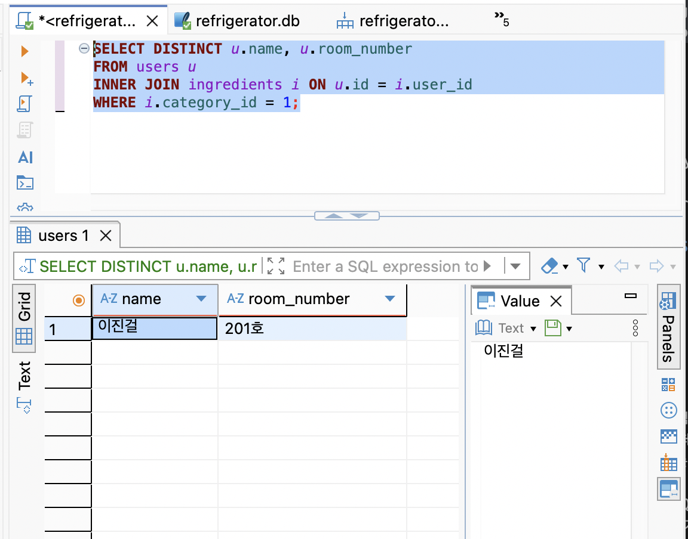
다음과 같다!

-- ㄴ. Subquery를 사용한 풀기
```SQL
SELECT name, room_number
FROM users
WHERE id IN (SELECT user_id FROM ingredients WHERE category_id = 1);
```
결과는:
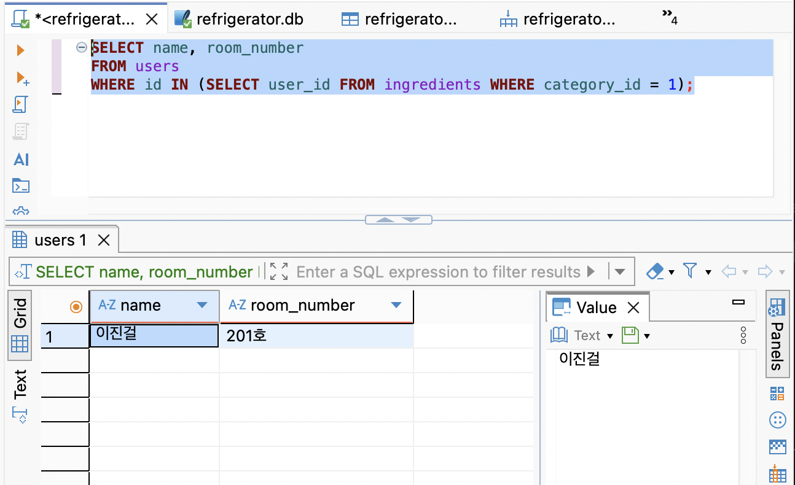

다음과 같다!

--두 방식의 차이점은:
직관성과 가독성: 데이터의 구조를 한눈에 파악하고 여러 컬럼을 동시에 가져오기에는 JOIN이 훨씬 직관적이다. 물론 우리는 지금 과제에서는 데이터의 절대 숫자가 매운 작은 table을 쓴다는 것을 잊지 말자.

성능적 관점 (MySQL/SQLite 내부 동작): 과거에는 서브쿼리가 성능상 불리한 경우가 많았으나, 현대의 DB 옵티마이저(엔진)는 매우 똑똑해서 서브쿼리를 내부적으로 JOIN 형태로 변환하여 거의 동일한 속도로 실행합니다. 다만, 서브쿼리의 결과 데이터양이 너무 비대해지면 메모리 낭비가 발생할 수 있으므로 대용량 데이터에서는 인덱스가 걸린 JOIN을 선호합니다.


## [보너스 실습_2. 데이터 정합성 깨뜨려 보기!] 
### 존재하지 않는 99번 사용자가 소고기를 넣었다고 억지를 부려보자!
```SQL
INSERT INTO ingredients (id, name, expiration_date, user_id, category_id) 
VALUES (11, '호주산 청정우', '2026-06-10', 99, 2);
```

결과는 놀랍게도 성공이다.
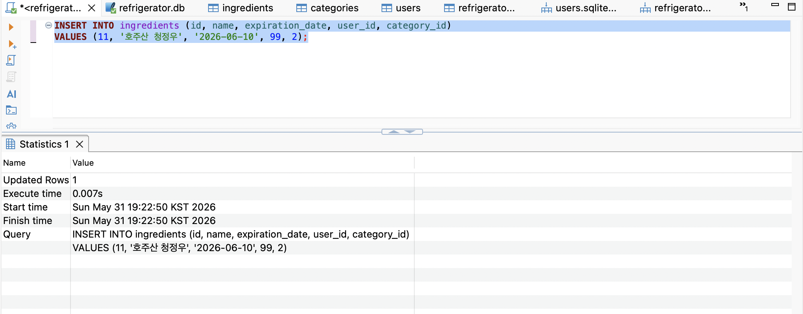

심지어 DB에도 user_id= 99가 밀어넣은 11번째 호주산 청정우가 보인다...!
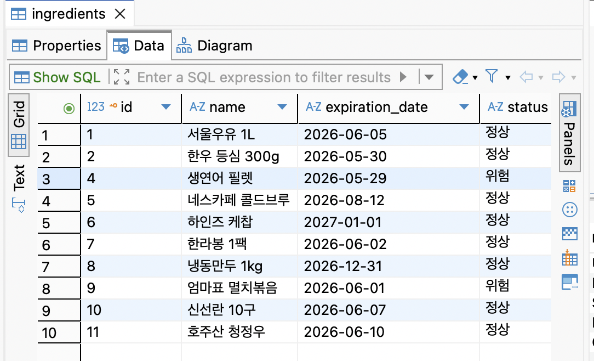
분명 FK를 열심히 적어두었는데, 이유가 무엇일까?
바로 - 검사기능을 따로 켜 줘야지 FK 감시가 들어가기 때문이다.
FK 감시를 위한 명령어는 
`PRAGMA foreign_keys = ON;` 을 활용한다.
우선 방금의 들어간 entry를 롤백한 뒤에 다시 명령어를 써 보자.
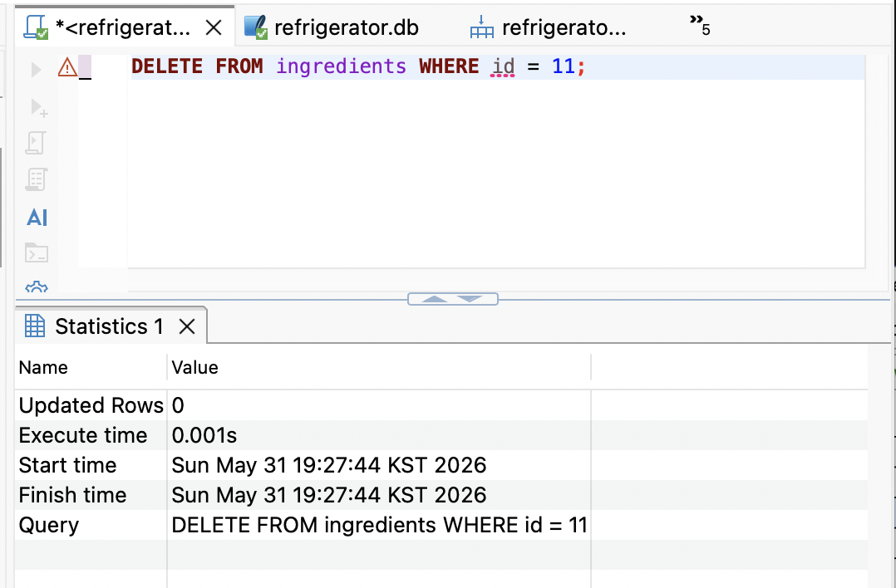
삭제 명령어를 실행했고, 
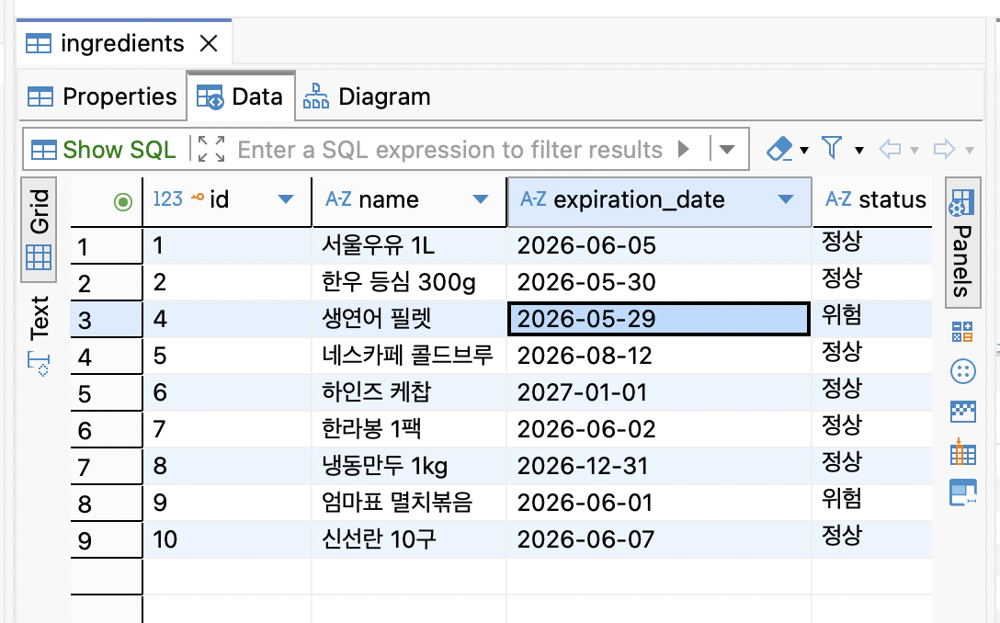
다시 청정우가 사라졌다.

이제 검사 기능을 켜보자.
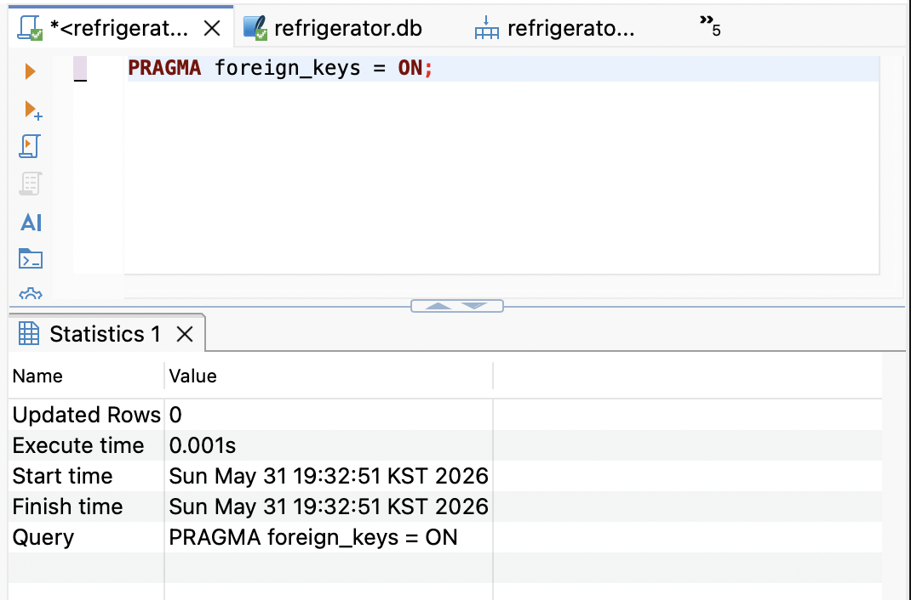
다시 user_id = 99인 query를 다시 넣어보면....
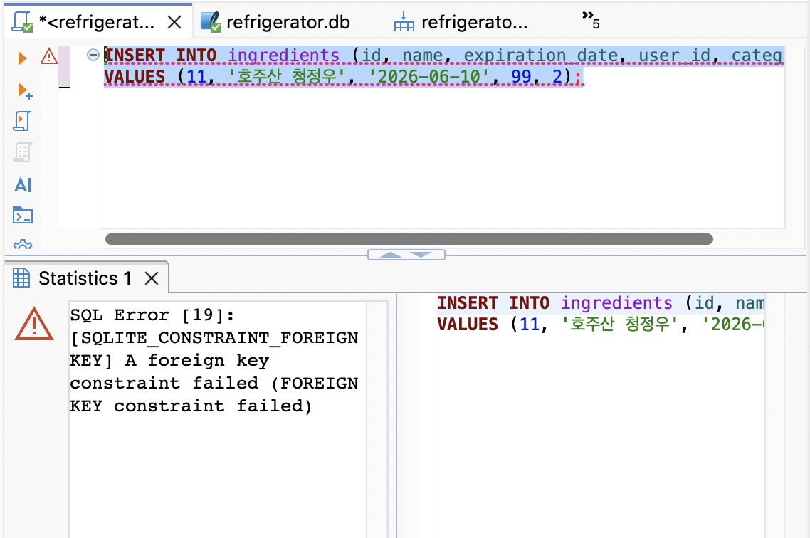


에러메시지 떴다!! FK 모니터링이 성공적으로 FK_constraint에서 벗어난 user_id 값을 막아냈다!


## [보너스 과제 3. 미니 리포트 만들기]

 (핵심 지표 3개)요구사항: "이 DB로 뽑을 수 있는 핵심 지표 3개"를 정의하고, 각각을 구하는 SQL을 최종본으로 정리한다.
주제: 셰어하우스 냉장고의 평화를 위한 핵심 통계 리포트   

📈 지표 1. 셰어하우스 최고의 '냉장고 빌런' (또는 방치 왕) 찾기정의: 냉장고에 식재료를 넣어두고 제때 치우지 않아 '폐기대상' 상태로 가장 많이 방치한 유저 TOP 1을 뽑습니다.
SQL 쿼리:
```SQL
SELECT u.name AS 사용자, COUNT(i.id) AS 폐기대상_방치_건수
FROM users u
INNER JOIN ingredients i ON u.id = i.user_id
WHERE i.status = '폐기대상'
GROUP BY u.name
ORDER BY 폐기대상_방치_건수 DESC
LIMIT 1;
```
결과는 다음과 같다. 아쉽게도 Query 13번을 실행했을 때 냉장고 빌런의 물건을 폐기했기 때문에 여기에는 답이 나오진 않았다.

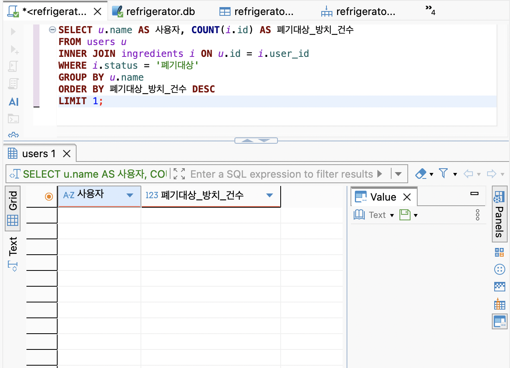

그래도 오리지날 DB를 검색해 보자면....
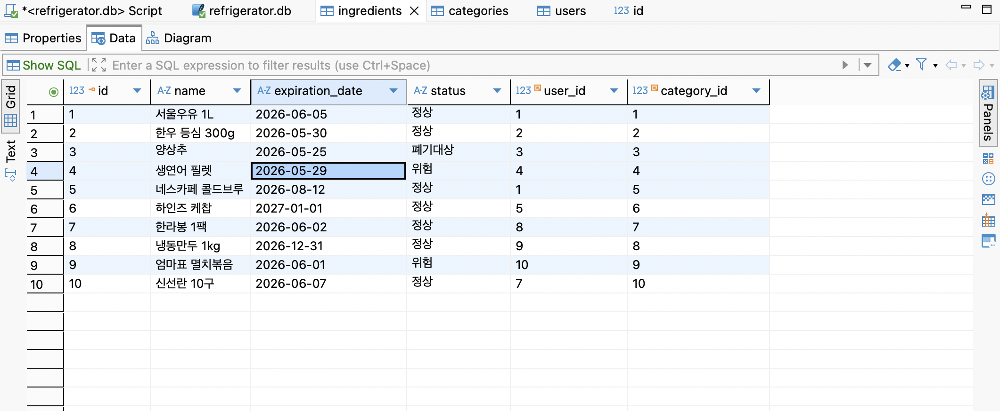

user_id 3이 빌런임을 알 수 있다.

📈 지표 2. 냉장고 회전율이 가장 높은 '인기 식재료 카테고리' TOP 3정의: refrigerator_logs에서 '반출(소비)' 로그가 가장 많이 발생한 식재료 카테고리가 무엇인지 파악하여, 셰어하우스 사람들이 가장 자주 먹는 음식을 분석합니다.
SQL 쿼리:
```SQL
SELECT c.category_name AS 카테고리, COUNT(l.id) AS 총_반출_건수
FROM refrigerator_logs l
INNER JOIN ingredients i ON l.ingredient_id = i.id
INNER JOIN categories c ON i.category_id = c.id
WHERE l.action_type = '반출'
GROUP BY c.category_name
ORDER BY 총_반출_건수 DESC
LIMIT 3;
```
유제품이 1등, 음료/주류가 2등이다.
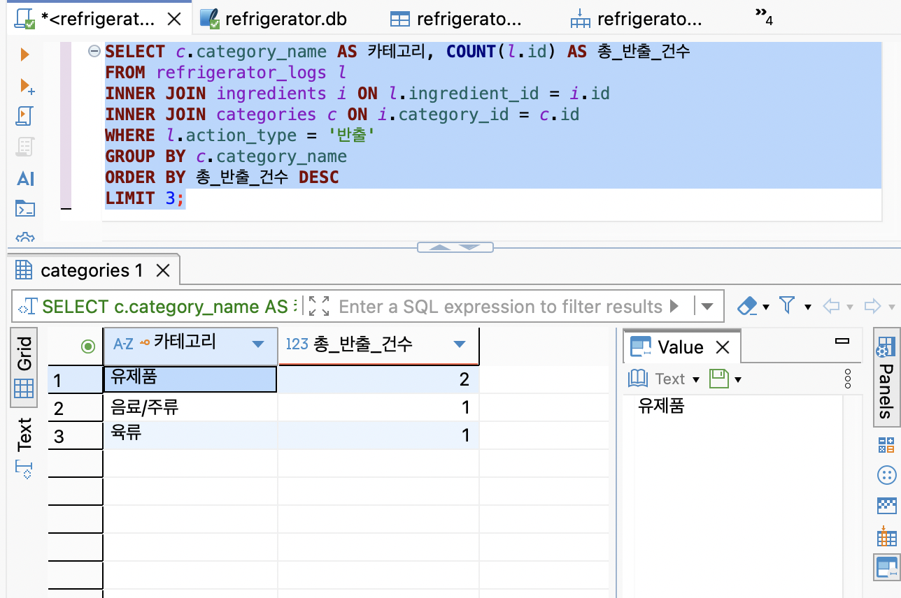


📈 지표 3. 현재 냉장고의 '위험도 종합 지수' (모니터링용)정의: 현재 냉장고 전체에 보관 중인 재료 대비, 유통기한이 지나거나 임박한('위험' + '폐기대상') 재료의 비율을 구합니다. (SQLite 특성에 맞춰 실수 계산 처리를 적용했습니다.)

SQL 쿼리:
```SQL
SELECT 
    COUNT(*) AS 전체_재료수,
    SUM(CASE WHEN status IN ('위험', '폐기대상') THEN 1 ELSE 0 END) AS 관리필요_재료수,
    -- 비율 계산 (SQLite에서 정수 나누기를 피하기 위해 100.0을 곱해줍니다)
    ROUND(SUM(CASE WHEN status IN ('위험', '폐기대상') THEN 1 ELSE 0 END) * 100.0 / COUNT(*), 1) || '%' AS 냉장고_위험도_비율
FROM ingredients;
```
다음과 같이 나온다.

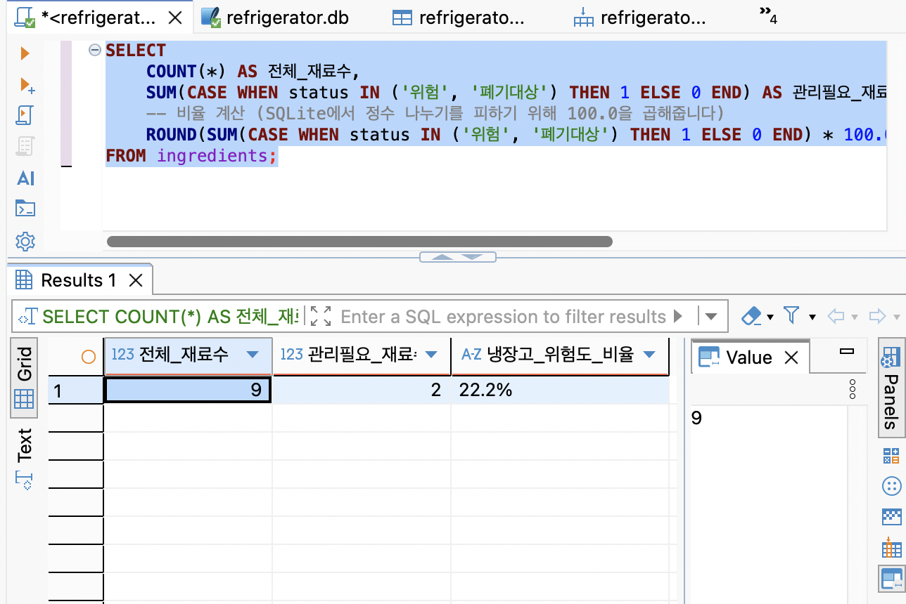

