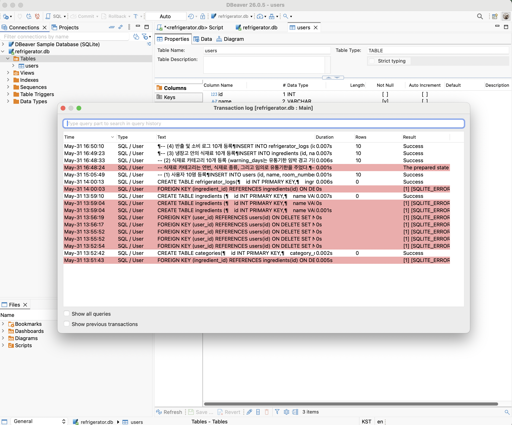

# 학습 후기

## 어려웠던 것들

SQL이라는 언어 자체도, script 에디터도 처음 다뤄보다 보니, 여러가지 에러들을 거쳐서 일들을 해야 했던 것이 못내 아쉽다.

log를 봤을 때, 단순한 typo 등으로 에러 메시지가 나는 경우, 드래그한 부분만 실행이 되는 경우(아예 몰랐던 상황 등) 등 처음부터 몰랐기에 좌충우돌하는 부분이 많았다. 
- 우선 캡쳐를 해서 Gemini에게 물어보는 식으로 하나하나 알아가면서 해결을 할 수는 있었으나, 구조화된 지식이 생길 때까지는 주먹구구식의 문제해결을 피하기는 힘들었다.
- 유튜브 영상 등을 여러 개 보면서 대략적인 지식을 얻을 수는 있었으나, 실제 써볼 줄 알게 될 때까지는 실습, 실행, 그리고 반복적인 연습이 필요했다.

## 추후 공부시 집중해야 할 점
- SQL에 테이블을 만들고, 데이터를 잔뜩 넣고, QUERY도 진행을 해 봤지만, '비즈니스 로직'에 따라서 데이터가 어떻게 움직이고 (예를 들어- 냉장고에서 음식을 먹으면 그것이 식재료 재고에 반영된다든가, 계란 같이 단위로 된 음식의 수량을 기재하는 등)그것이 반영되고 하는 것들을 다뤄보면 좋을 것으로 보인다.

- 또한, AI 학습 등을 위해서 데이터베이스를 활용하는 경우에는 이미 만들어진 데이터셋을 학습하는 경우가 많으니 SELECT를 잘 다루는 데에 집중해야 할 수도 있다.

## 학습 자체에 대한 고찰

- 기초 과정의 큰 주제가 일곱 가지나 되는데, 생각해 보면 각 주제가 책 한권씩이라는 무서운 진도이다.
- 육개월도 안 되는 시간 안에 전공서적을 여섯 권 이상 (파악하는 것만 해도 리눅스 운영체게, 파이썬 Redis, React, SQL/DB, 클라우드, CI/CD) 떼라는 요청으로 받아들이면 공부의 밀도가 너무나도 커지는 것이며, 교육생들에게 요구되어지는 사항은 이것이 아닐 것으로 보인다.
-  특정 문제를 해결하기 위한 need-to-know 기반의 최소한의 지식/스킬을 얻었으면 그것으로 바로 문제를 해결하는 것이 그 주제를 완전히 배우는 것보다 우선순위가 높아 보인다.
- 결국, 교육생은 본인이 문제를 스스로 설정하고, 달성/제약조건을 스스로 걸어서 스스로를 위한 PBL을 만들 수 있는 수준이 되는 것을 목표로 해야 할 것으로 보인다.
[끝]

