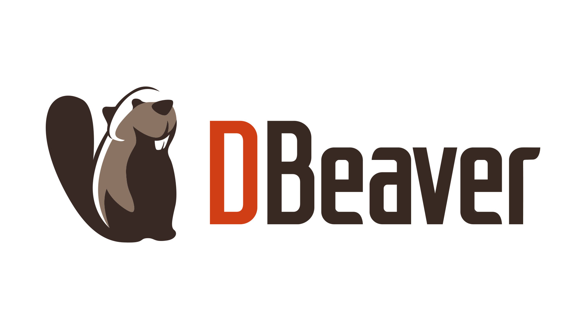
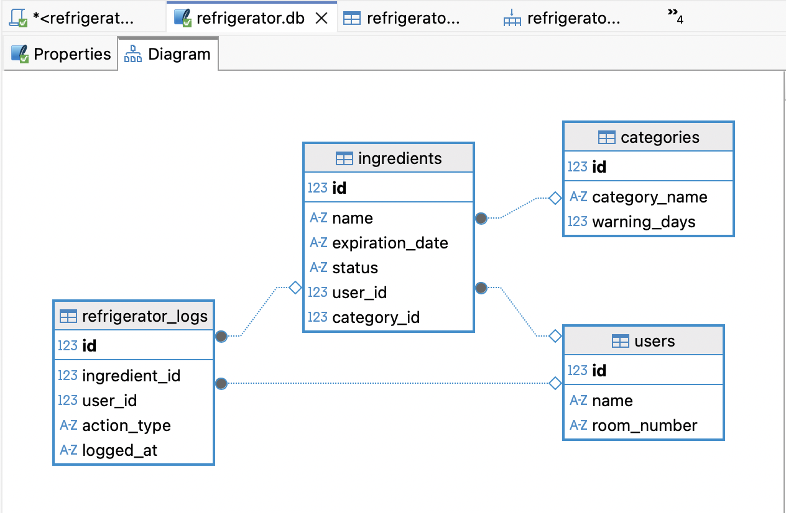
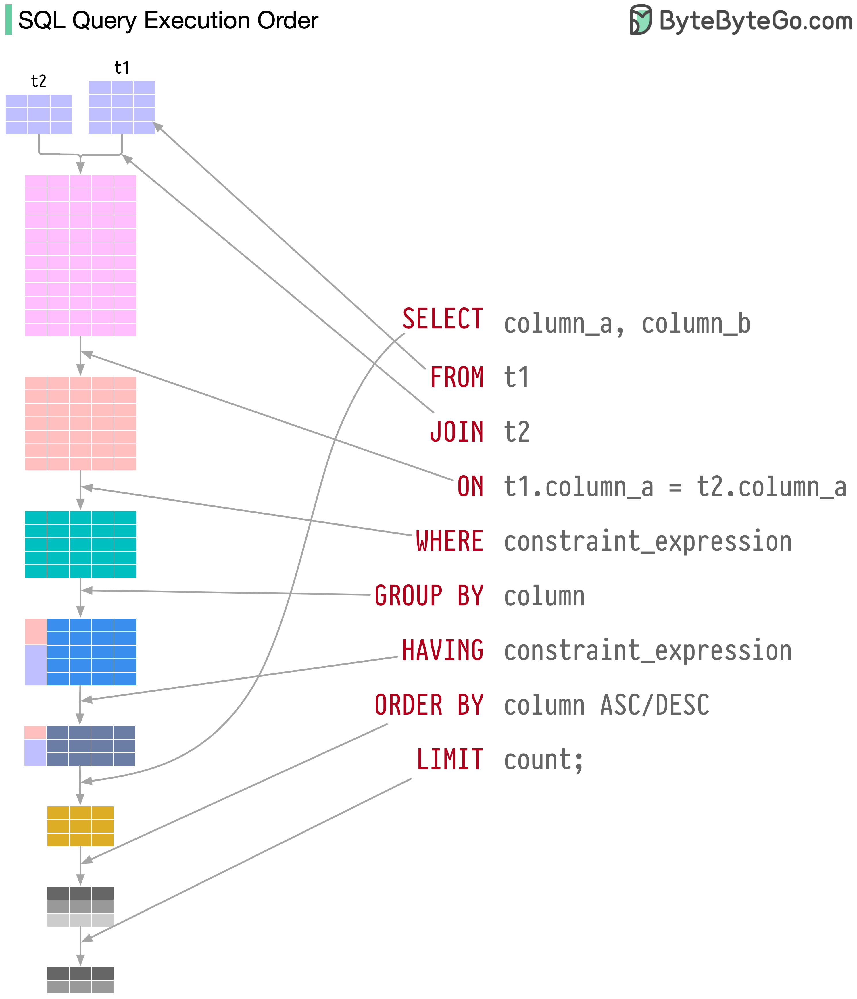

# AI/SW 기초과정 B5-1: SQL로 만드는 나만의 데이터베이스

## 취지:
- 본 과제를 수행하면서, SQL이라는 언어를 활용해서 데이터베이스를 만들고, 다루는 역할을 해 본다.

## 최종 결과물
다음 네 가지를 만족하는 SQL 기반 데이터베이스 실습 결과물을 완성한다. (백엔드 프레임워크 사용 금지)
1. 도메인 데이터베이스 1개 설계
- 자유 주제(예: 도서 대여, 영화 평점, 카페 주문, 여행 일정, 학급 관리 등)를 정하고 최소 4개 테이블을 만든다.
- 테이블 간 1:N 관계가 최소 2개 이상 포함되어야 한다.
2. 스키마 생성 스크립트 1개
- CREATE TABLE 로 스키마를 정의하고, PK/FK/제약조건을 포함한다.
- 실행 순서대로 정리된 .sql 파일 1개로 제출 가능해야 한다.
3. 샘플 데이터 입력 스크립트 1개
- 각 테이블에 의미 있는 샘플 데이터가 들어가도록 INSERT 를 작성한다.
- 각 테이블당 최소 10행 이상 데이터가 존재해야 한다.
4. 핵심 쿼리 15개 + 실행 결과 캡처
- 조회/조인/집계/서브쿼리/수정 및 삭제까지 포함한 쿼리 15개를 작성한다.
- 각 쿼리의 실행 결과를 스크린샷(또는 결과 텍스트)로 남긴다.


## 실행 순서


[기본개념정리](00.Basic_Concepts.md)


[기본 환경 설정](01.DB_Environment_Setup.md)

[테이블 생성 및 데이터 입력](02.Schema_Creation_and_sample_data_insertion.md)
```SQL
CREATE TABLE users (  
    id INT PRIMARY KEY, 
    name VARCHAR(50) NOT NULL, 
    room_number VARCHAR(10) 
);
```


[테이블 ERD](03.Refrigerator_erd.md)

[15개의 Query문](04.Fifteen_Essential_SQL_Queries.md)

[보너스 과제](05.Bonus.md)


[학습 리뷰](06.Future%20Works.md)


